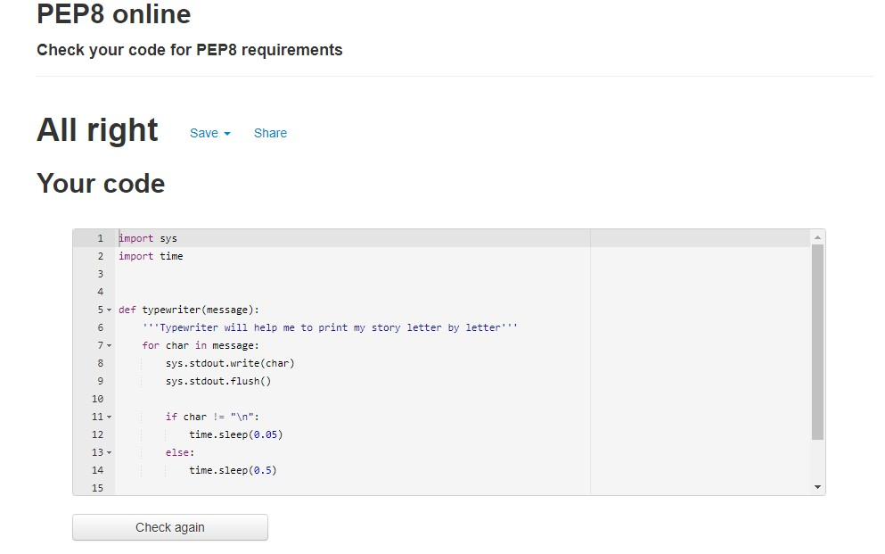

# Escape The Cave
This Project is builted for Code Institute 3rd Milestone Project. Mainly python language is used, the main purpose is to test our python knowledge.
Project, on the other hand, is an adventure game that I created inspired by a short story I wrote.

### For Live Site [Click Here](https://escape-the-cave1.herokuapp.com/).

# Table of Content
1. [Project Goals](#project-goals)
    - [Site Owner Goals](#site-owner-goals)
2. [User Experience](#user-experience)
    - [Target Audience](#target-audience)
    - [User Stories](#user-stories)
3. [Technical Design](#technical-design)
    - [Flowchart](#flowchart)   
4. [Technologies Used](#technologies-used)
5. [Features](#features)
6. [Tests](#tests)
    - [PEP8 Tests](#pep8-tests)
    - [Code Improvements](#code-improvements)
10. [Deployment](#deployment)
11. [Credits](#credits)
12. [Acknowledgements](#acknowledgements)

## Project Goals
---
### Site Owner Goals
1. As a site owner, I want to provide clear instructions.
1. As a site owner, I want to provide a fluent adventure story.
1. As a site owner, I want an interface that fits the story.
1. As a site owner, I want to prevent the game from breaking in any scenario.

## User Experience
---
### Target Audience
Site owners audience is people at any age:
1. Those who can read.
1. Who enjoys the adventure games.
1. Who enjoys reading stories.
1. Who enjoys playing story games.
### User Stories
1. As a user, I want to spend my time with an adventurous game.
1. As a user, I want an easy guidance.
1. As a user, I want the game to let me try again on any error or mistake.
1. As a user, I want to start again, when I lost the game.

## Technical Design
---
### Flowchart

As you can see on the flowchart logic of the game is to provide user two options and ask them to enter a letter to provide an input and this input will lead to another input. On any invalid input user will go back the same step not the beginning of the game. End of the game there will be another input that asks if user wants to play again or not.

## Technologies Used
---
I have used several technologies for building this project:
- ### [Python](https://www.python.org/)
     - Python is the core programming language used to write all of the code in this application to make it fully functional.
    - ### In addition to core Python, I have used some of the python libraries:
         1. ### Colorama: 
            The Colorama is one of the built-in Python modules to display the text in different colors. It is used to make the code more readable. Three formatting options are available in this module for coloring text. These are Back, Fore and Style. 
         1. ### Pyfiglet:
            The Pyfiglet module is a Python module that comes with many functions, and we can use these functions in a Python program to create fancy texts with large fonts & sizes in the output.
        1. ### Time:
            The Python time module provides many ways of representing time in code, such as objects, numbers, and strings. It also provides functionality other than representing time, like waiting during code execution and measuring the efficiency of your code.
        1. ### Sys:
            The sys module in Python provides various functions and variables that are used to manipulate different parts of the Python runtime environment. It allows operating on the interpreter as it provides access to the variables and functions that interact strongly with the interpreter
    - ### [Github](https://github.com/)
        - GitHub is a code hosting platform for version control and collaboration. It lets you and others work together on projects from anywhere.
    - ### [Gitpod](https://gitpod.io/)
        - Used as the development enviroment.
    - ### [Heroku](heroku.com)
        - Used to deploy my application.
    - ### [Lucid](https://lucid.app/)
        - Used to create the flowchart for my project.
    - ### [PEP8](http://pep8online.com/)
        - Used to test my code for any issues or errors.
## Features
---
### 1. Banner
I have created function called banner in banner.py file. This function is created using [pyfiglet](#technologies-used) and [colorama](#technologies-used). This feature will turn your word or sentence into ASCII art for selected font and style.

### 2. TypeWriter
 I have created function called typewriter in typewriter.py file. This function created using [sys](#technologies-used) and [time](#technologies-used. This feature enabled me to print my story letter by letter to create better understanding for the user.

 
###  Colored Text
I have created variables to color my texts to make it easier for the user to read the story. For colors I have used [colorama](#technologies-used).

### Example usage of color variables:
---

# Tests
## PEP8 Tests
- ### run.py PEP8 test

    
- ### banner.py PEP8 test
    
- ### typewriter.py PEP8 test
    
- ### thanks.py PEP8 test
    

## Code Improvements
I have shared my code on slack peer-code-review channel and got some suggestions I share the screenshot of the suggestions I have replaced the if and else  statements as sugested and changed the function names as sugested and with adding elif and else statement on mentioned if statement crashing issue has also been resolved and the commit message has been changed. 
Many thanks to [Shane Muir](https://www.linkedin.com/in/shanemuirhead/) and [Simen Daehlin](https://www.linkedin.com/in/simendaehlin/) for these suggestions.

# Deployment

The master branch of this repository has been used for the deployed version of this application.

### Using Github & Gitpod

To deploy my command-line interface application, I had to use the [Code Institute Python Essentials Template](https://github.com/Code-Institute-Org/python-essentials-template), as this enables the application to be properly viewed on Heroku using a mock terminal. 

- Click the `Use This Template` button.
- Add a repository name and brief description.
- Click the `Create Repository from Template` to create your repository.
- To create a Gitpod workspace you then need to click `Gitpod`, this can take a few minutes.
- When you want to work on the project it is best to open the workspace from Gitpod (rather than Github) as this will open your previous workspace rather than creating a new one. You should pin the workspace so that it isn't deleted.
-  Committing your work should be done often and should have clear/explanatory messages, use the following commands to make your commits:
    - `git add .`: adds all modified files to a staging area
    - `git commit -m "A message explaining your commit"`: commits all changes to a local repository.
    - `git push`: pushes all your committed changes to your Github repository.

*Forking the GitHub Repository*

If you want to make changes to your repository without affecting it, you can make a copy of it by 'Forking' it. This ensures your original repository remains unchanged.

1. Find the relevant GitHub repository
2. In the top right corner of the page, click the Fork button (under your account)
3. Your repository has now been 'Forked' and you have a copy to work on

*Cloning the GitHub Repository*

Cloning your repository will allow you to download a local version of the repository to be worked on. Cloning can also be a great way to backup your work.

1. Find the relevant GitHub repository
2. Press the arrow on the Code button
3. Copy the link that is shown in the drop-down
4. Now open Gitpod & select the directory location where you would like the clone created
5. In the terminal type 'git clone' & then paste the link you copied in GitHub
6. Press enter and your local clone will be created.

### Creating an Application with Heroku

I followed the below steps using the Code Institute tutorial:

- The following command in the Gitpod CLI will create the relevant files needed for Heroku to install your project dependencies `pip3 freeze --local > requirements.txt`. Please note this file should be added to a .gitignore file to prevent the file from being committed.

1. Go to [Heroku.com](https://dashboard.heroku.com/apps) and log in; if you do not already have an account then you will need to create one.
2. Click the `New` dropdown and select `Create New App`.
3. Enter a name for your new project, all Heroku apps need to have a unique name, you will be prompted if you need to change it.
4. Select the region you are working in.

*Heroku Settings*
You will need to set your Environment Variables - this is a key step to ensuring your application is deployed properly.
- In the Settings tab, click on `Reveal Config Vars` and set the following variables:
    - If using credentials you will need to add the credentials as a variable, the key is the name 'CREDS' and the value is the contents of your creds JSON
    - Add key: `PORT` & value `8000`
- Buildpacks are also required for proper deployment, simply click `Add buildpack` and search for the ones that you require.
    - For this project, I needed to add `Python` and `Node.js`, in this order.

*Heroku Deployment*
In the Deploy tab:
1. Connect your Heroku account to your Github Repository following these steps:
    1. Click on the `Deploy` tab and choose `Github-Connect to Github`.
    2. Enter the GitHub repository name and click on `Search`.
    3. Choose the correct repository for your application and click on `Connect`.
2. You can then choose to deploy the project manually or automatically, automatic deployment will generate a new application every time you push a change to Github, whereas manual deployment requires you to push the `Deploy Branch` button whenever you want a change made.
3. Once you have chosen your deployment method and have clicked `Deploy Branch` your application will be built and you should see the below `View` button, click this to open your application:

# Credits
All the code is written by me, I have mostly used slack to solve my problems and to find libraries I need I have used [PypI](https://pypi.org/).

My app background is from [Vecteezy](https://www.vecteezy.com/)

My [Deployment](#deployment) section is copied from [Daisy Gunn](https://www.linkedin.com/in/daisy-lindsay-gunn-7ba08b165/)'s [my-contact-book project](https://github.com/daisygunn/my-contact-book).

# Acknowledgements

I would like to thank my course mentor [Harry Dhillon](https://www.linkedin.com/in/harry-dhillon-299b321b3/)